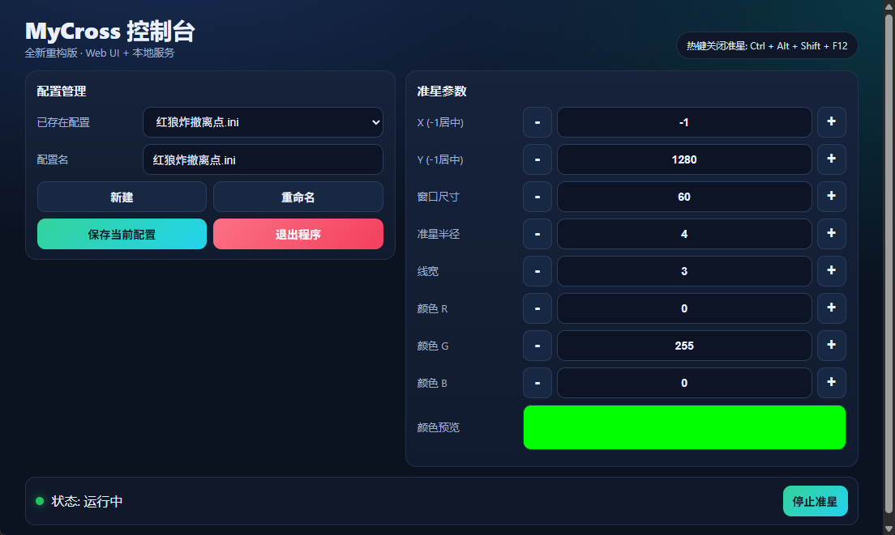

# MyCross

<p align="center">
  <b>一个基于 C++ 与 WebView2 的游戏准星叠加工具</b><br>
  <sub>Lightweight Crosshair Overlay Tool built with C++ & WebView2</sub>
</p>

---

## 📸 预览

<p align="center">
  
</p>

---

## ✨ 功能特性

- 🎯 启动 / 停止准星叠加
- 🎛 参数调节：位置、尺寸、线宽、RGB 颜色
- 📁 配置管理：新建、加载、保存、重命名
- ⚡ 下拉选择配置时自动应用
- ⌨️ 全局快捷键关闭准星：`Ctrl + Alt + Shift + F12`

---

## 🧠 技术实现

- 使用 **C++** 构建核心逻辑与渲染控制
- 使用 **WebView2** 构建前端 UI
- 前后端通过 `postMessage` 进行通信
- 实现参数控制、配置管理与状态同步

---

## 🚀 构建与运行

### 环境要求

- Windows 11
- CMake 4.0.2
- Build Tools for Visual Studio（安装 `Desktop development with C++` 工作负载）
- Ninja
- WebView2 Runtime（Windows 11 已内置）

### 构建方式

不需要打开 Visual Studio IDE。`build.bat` 会通过 `vswhere.exe` 自动查找 Build Tools 并初始化 MSVC x64 编译环境，然后使用 CMake Preset + Ninja 构建。

```bat
build.bat
```

如果自动发现失败，也可以把 `vcvars64.bat` 的完整路径写入 `VCVARS64_BAT` 作为兜底：

```bat
setx VCVARS64_BAT "D:\Program Files\VS\VC\Auxiliary\Build\vcvars64.bat"
```

也可以手动使用 CMake Preset：

```bat
cmake --preset msvc-ninja-release
cmake --build --preset msvc-ninja-release
```
